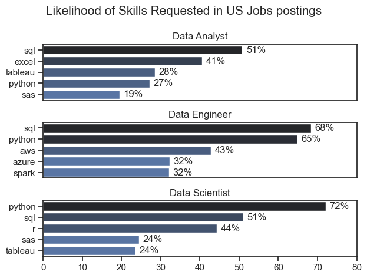
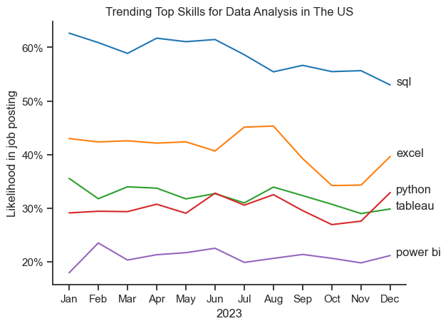
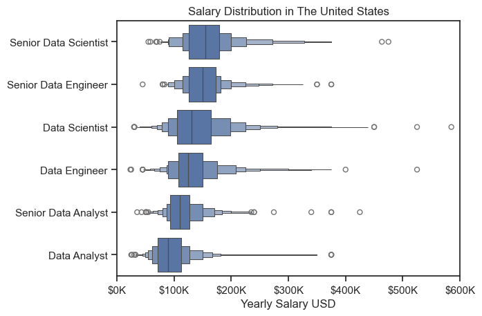
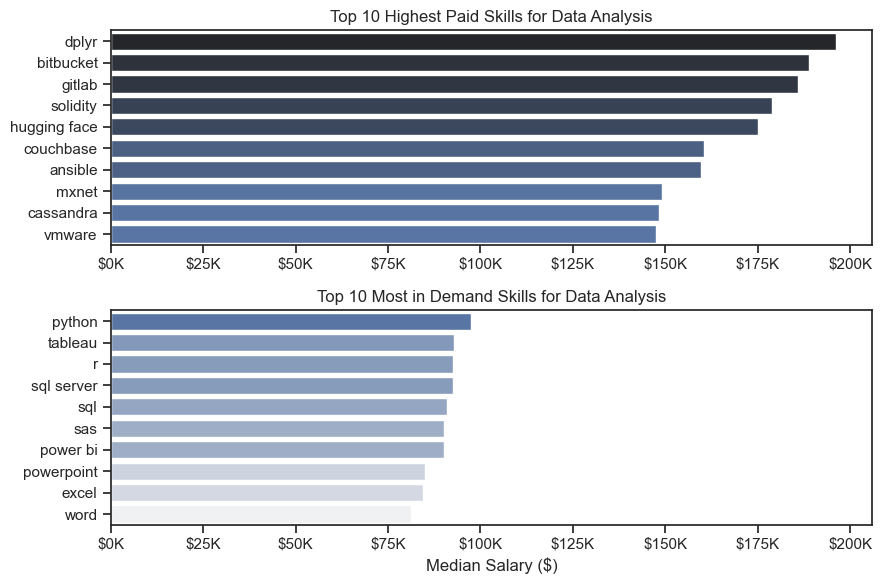
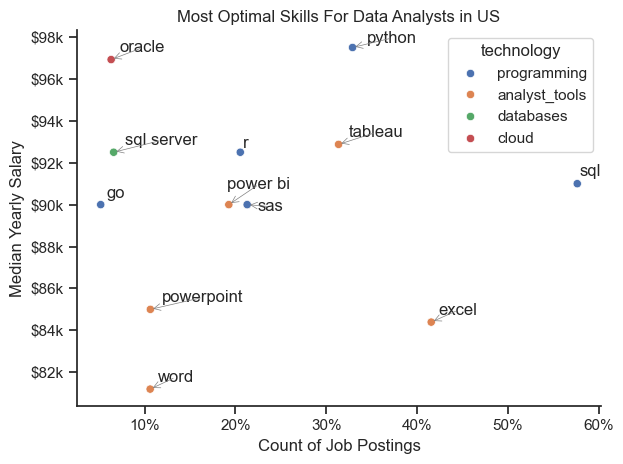

# Introduction

Welcome to my analysis of the data job market, focusing on data analyst roles. This project was created out of a desire to navigate and understand the job market more effectively. It delves into the top-paying and in-demand skills to help find optimal job opportunities for data analysts.

The data sourced from Luke Barousse's Python Course which provides a foundation for my analysis, containing detailed information on job titles, salaries, locations, and essential skills. Through a series of Python scripts, I explore key questions such as the most demanded skills, salary trends, and the intersection of demand and salary in data analytics.

# Background and curiosity 
Below are the questions I want to answer in my project:

1. What are the skills most in demand for the top 3 most popular data roles?

2. How are in-demand skills trending for Data Analysts?

3. How well do jobs and skills pay for Data Analysts?

4. What are the optimal skills for data analysts to learn? (High Demand AND High Paying)

# Tools at Play
 For my deep dive into the data analyst job market, I harnessed the power of several key tools:

Python: The backbone of my analysis, allowing me to analyze the data and find critical insights.I also used the following Python libraries:
1. **Pandas Library**: This was used to analyze the data.

2. **Matplotlib Library**: I visualized the data.

3. **Seaborn Library**: Helped me create more advanced visuals.

4. **Jupyter Notebooks**: The tool I used to run my Python scripts which let me easily include my notes and analysis.

5. **Visual Studio Code**: My go-to for executing my Python scripts.

6. **Git & GitHub**: Essential for version control and sharing my Python code and analysis, ensuring collaboration and project tracking.

# The Analysis

## 1. What are the most demand skills for the top 3 most popular data role ?

To find the most demanded skills for the top 3 most popular data roles. I filtered out those positions by which ones were the most popular, and got the top 5 skills for these top 3 roles.
This query highlights the most popular job titles and their top skills, showing which skills I should pay attention to depending on the role I'm targeting.

View my notebook with detailed steps here: [2_Skills_Count.ipynb](Final_Project_Intro/Final_Project/2_Skills_Count.ipynb)

## Visualize Data

```python
fig, ax = plt.subplots(len(job_titles), 1)
sns.set_theme(style='ticks')
for i, job_title in enumerate(job_titles):
    df_plot = df_skill_percent[df_skill_percent['job_title_short']==job_title].head(5)
    sns.barplot(data=df_plot, x='skill_percent', y='job_skills', ax=ax[i], hue='skill_count', palette='dark:b_r') 
    ax[i].set_xlim(0,80)
    ax[i].set_title(job_title)
    ax[i].legend().set_visible(False)
    ax[i].set_ylabel('')
    ax[i].set_xlabel('')

    for n,v in enumerate(df_plot['skill_percent']):
        ax[i].text(v+1,n ,f'{v:.0f}%' ,va='center')

    if i != len(job_titles)-1:
     ax[i].set_xticks([])

fig.suptitle('Likelihood of Skills Requested in US Jobs postings', fontsize = 15)
fig.tight_layout()
plt.show()
```


## Results




## Insights


The analysis of skill requirements across three key data roles - Data Analyst, Data Engineer, and Data Scientist - reveals distinct patterns in the technical expertise employers seek for each position.

### Role-Specific Technical Profiles
**Data Analyst** Positions emphasize data manipulation and visualization tools, with SQL (51%) and Excel (41%) being the most demanded skills. This aligns with the role's focus on extracting insights from structured data and presenting them in business-friendly formats. Tableau (28%) appears as the preferred visualization tool, while Python (27%) and SAS (19%) round out the technical stack.

**Data Engineer** roles demonstrate a clear engineering orientation, with database and cloud implementation skills paramount. SQL leads at 68%, followed closely by Python at 65%. The significant demand for AWS (43%), Azure (32%), and Spark (32%) highlights the cloud-based and big data processing requirements critical for building robust data infrastructure.


**Data Scientist** positions show the strongest programming language preference with Python dominating at 72%, the highest percentage across all skills and roles. SQL remains important (51%), while R (44%) appears uniquely prominent for this role, reflecting its statistical heritage and popularity in research-oriented environments. Visualization and analysis tools like SAS and Tableau (both 24%) are requested but at lower rates than core programming skills.

### Cross-Role Skill Analysis
SQL emerges as the universal technical language across all data roles, appearing in the top two most requested skills for each position. This underscores the fundamental importance of database querying abilities regardless of specialization.


Python shows remarkable versatility, with strong demand across all three roles but particularly for Data Scientists (72%) and Data Engineers (65%). This indicates Python's evolution from a specialist language to an essential tool throughout the data workflow.


Strategic Implications for Career Development
The data suggests that aspiring professionals should prioritize SQL and Python as foundational skills applicable across the data domain. Role specialization then requires additional focused expertise:

**Data Analysts should emphasize visualization tools and business intelligence platforms.**

**Data Engineers should develop cloud infrastructure and big data processing capabilities**

**Data Scientists should deepen their programming and statistical modeling abilities**

These skill demand patterns reflect the increasing maturity of the data profession, with clear specialization paths emerging while maintaining a common technical foundation that facilitates collaboration across roles.

## 2. How are in-demand Skills trending for Data Analysis
### Visualize Data

```python
df_plot = df_us_percent.iloc[:,:5]
sns.lineplot(data=df_plot, dashes=False, palette='tab10')
sns.despine()
sns.set_theme(style='ticks')
plt.xlabel('2023')
plt.legend().remove()
plt.ylabel('Likelihood in job posting')
plt.title('Trending Top Skills for Data Analysis in The US')
from matplotlib.ticker import PercentFormatter
ax = plt.gca()
ax.yaxis.set_major_formatter(PercentFormatter(decimals=0))
for i in range(5):
    plt.text(11.2, df_plot.iloc[-1,i], df_plot.columns[i])
```

### Results




### Insight

SQL remains the dominant skill throughout 2023, though we can observe a gradual decline from around 62% likelihood in job postings at the beginning of the year to approximately 52% by December. Despite this downward trend, SQL maintains a substantial lead over other skills, underscoring its continued importance as a foundational data analysis skill.


Excel follows as the second most in-demand skill, showing interesting fluctuations. It maintained relatively stable demand (around 42%) for the first half of the year, peaked in July-August at approximately 45%, but then experienced a significant drop to about 34% by October before rebounding to nearly 40% by year-end. This V-shaped recovery in the latter part of 2023 suggests Excel remains resilient despite the rise of more advanced tools.


Python shows one of the most notable positive trends. While starting the year as the fourth most requested skill (behind SQL, Excel, and Tableau) at around 29%, Python steadily gained momentum, particularly in the last quarter. By December, Python had surpassed Tableau to become the third most in-demand skill at approximately 33%, showing the strongest upward trajectory among all tracked skills.


Tableau demonstrates volatility throughout the year, fluctuating between 28-33%. It shows an interesting pattern of peaks and valleys, with notable dips in April and October, suggesting seasonal hiring patterns for visualization specialists. By year-end, Tableau (around 30%) was narrowly overtaken by Python.


Power BI consistently remains the least requested skill among those tracked, maintaining a relatively stable position between 20-23% throughout the year. However, its persistence in job postings indicates it has established itself as a standard part of the data analysis toolkit.


The convergence of Python, Tableau, and to some extent Excel in December 2023 (all within approximately 10 percentage points of each other) suggests employers are increasingly valuing a multi-tool approach to data analysis rather than specialization in a single platform.


The overall trends indicate a potential shift toward more programmatic data analysis approaches (Python's rise) while maintaining the importance of traditional database skills (SQL's dominance despite decline), pointing to an evolving but balanced data analysis landscape in the US job market.


## 3. How Well do jobs and skills pay for Data Analyst?

### Salary Analysis for Data Roles

#### Visualize Data

```python
sns.boxenplot(data = df_top_6, x = 'salary_year_avg', y='job_title_short', order=job_order)
sns.set_theme(style='ticks')
plt.title('Salary Distribution in The United States')
plt.xlim(0,600000)
ticks_x=plt.FuncFormatter(lambda y, pos: f'${int(y/1000)}K')
plt.gca().xaxis.set_major_formatter(ticks_x)
plt.ylabel('')
plt.xlabel('Yearly Salary USD')
plt.show()
```

#### Results



## Insights

#### Clear Seniority Premium

Senior roles (Data Scientist, Data Engineer, Data Analyst) each earn a noticeable salary bump compared to their non‐senior counterparts.
Senior Data Scientists and Senior Data Engineers, in particular, command the top medians, around the 
140
k–
160
k
140k–160k range.

#### Wide Range of Outliers

Data Scientist and Senior Data Scientist roles show a particularly wide spread of salaries. Some individuals in those roles earn beyond $400k, and a few even push or exceed $500k. This could reflect specialized expertise, leadership roles, or higher compensation in top tech hubs.

#### Data Engineers vs. Data Scientists

While Data Engineers and Data Scientists have overlapping salary bands, Data Scientists generally show a slightly higher median and more upper-end outliers. This might signal higher variance in Data Scientist compensation—often dependent on domain expertise or industry sector.

#### Data Analysts

The typical Data Analyst range is roughly $60k–$80k, climbing up to around $90k for Senior Data Analysts. Outliers do creep higher, but in general, the spread is narrower than the engineering or scientist roles.

#### Overall Trend

As expected, jobs that demand more specialized skills (like advanced machine learning or big data infrastructure) reward higher salaries.
The transition from analyst to engineer/scientist roles can yield a significant salary jump, illustrating how advanced technical skills are in high demand.


## 4. Highest Paid & Most Demand Skills for Dat Analyst

#### Visualize Data

```python

fig, ax = plt.subplots(2,1 , figsize=(9,6))


sns.set_theme(style='ticks')
sns.barplot(data=df_top_pay, x = 'median', y=df_top_pay.index, ax=ax[0], hue='median', palette='dark:b_r')
ax[0].set_title('Top 10 Highest Paid Skills for Data Analysis')
ax[0].set_ylabel('')
ax[0].set_xlabel('')
ax[0].legend().remove()
ax[0].xaxis.set_major_formatter(plt.FuncFormatter(lambda x, pos: f'${int(x/1000)}K'))


sns.barplot(data=df_top_skill, x = 'median', y=df_top_skill.index, ax=ax[1], hue='median', palette='light:b')
# df_top_skill[::-1].plot(kind='barh',y='median',ax=ax[1])

ax[1].set_title('Top 10 Most in Demand Skills for Data Analysis')
ax[1].set_ylabel('')
ax[1].set_xlabel('Median Salary ($)')
ax[1].legend().remove()
ax[1].set_xlim(ax[0].get_xlim())
ax[1].xaxis.set_major_formatter(plt.FuncFormatter(lambda x, pos: f'${int(x/1000)}K'))
plt.tight_layout()

plt.show()
```
## Results
Breakdown of Highest Paid & most in deman skills for Data Analyst in US




## Insights

Here are a few observations you might draw from these two bar charts:

1. **Highest-Paying vs. Most-In-Demand**  
   - The top-paying skills (dplyr, bitbucket, gitlab, etc.) are quite different from the top in-demand skills (python, tableau, r, etc.).  
   - In other words, **the skill set that commands the very highest median salaries** isn’t necessarily the same as the one that appears **most frequently in job listings**.

2. **Specialized vs. Widely Adopted**  
   - Skills like dplyr, bitbucket, and hugging face (in the top-paying list) tend to be more specialized or niche, often associated with specific ecosystems (e.g., DevOps, advanced ML frameworks, or specialized R libraries).  
   - On the other hand, the widely demanded skills (python, tableau, r, SQL, etc.) are **more general-purpose**, so a broader range of roles require them—even if their median pay doesn’t peak as high as some of the more specialized technologies.

3. **Salary Range Differences**  
   - The first chart’s salaries easily stretch toward \$150K–\$200K.  
   - The second chart hovers closer to the \$90K–\$110K range in many cases (by visual estimation).  
   - This suggests **niche expertise** in certain tools is commanding a bigger pay premium, whereas widely used “core analytics” skills have a lower but still substantial median salary.

4. **High Demand ≠ Highest Pay**  
   - Python is at the very top of “most in demand,” yet it doesn’t show up in the “highest paid” list.  
   - This often happens because mainstream skills (like python, SQL, Excel) are vital in almost every data role, so **they’re demanded everywhere** but don’t necessarily set you apart for premium pay.

5. **Strategic Skill Development**  
   - If the goal is **broad job opportunities**, focusing on high-demand skills (Python, SQL, BI tools) is wise.  
   - If your focus is **maximizing salary**, exploring specialized technologies (like the top-paying ones) could pay off—but there may be fewer jobs requiring them, so you’d be aiming at a more niche market.

Overall, these two charts illustrate a common trade-off in the tech world: **skills that are “must-haves” for most data analyst roles** tend to appear the most often in job postings, while **more narrowly focused or cutting-edge skills** (even in the data space) can fetch higher salaries but are needed by a smaller slice of employers.


## 4. What is the most Optimal Skill to learn for Data Analyst?

### Visualize Data

```python
from adjustText import adjust_text

# df_skill_high_demand.plot(kind='scatter', x='skill_percent', y='median_salary')

sns.scatterplot(data = df_plot, x = 'skill_percent', y='median_salary', hue='technology')
sns.despine()
sns.set_theme(style='ticks')
# Prepare texts for adjustText
texts = []
for i, txt in enumerate(df_skill_high_demand.index):
    texts.append(plt.text(df_skill_high_demand['skill_percent'].iloc[i], df_skill_high_demand['median_salary'].iloc[i], txt))

adjust_text(texts, 
            arrowprops=dict(arrowstyle='->', color='gray', lw=0.5),  # Lighter arrows for visibility
            expand=(1.5, 1.5),  # Increase spacing buffer
            force_text=(0.5, 1.0),  # Stronger push on labels
            force_points=(0.3, 0.6),  # Adjust force between points
            only_move={'points': 'y', 'text': 'xy'},  # Allow movement in both directions
            autoalign='y',  # Try auto-aligning text vertically
            avoid_points=True,  # Prevent overlap with points
            min_distance=10,  # Ensure minimum spacing
            lim=1000)  # Increase max iterations for adjustments


# Set axis labels, title, and legend
plt.xlabel('Count of Job Postings')
plt.ylabel('Median Yearly Salary')
plt.title('Most Optimal Skills For Data Analysts in US')

from matplotlib.ticker import PercentFormatter
ax=plt.gca()
ax.yaxis.set_major_formatter(plt.FuncFormatter(lambda y, pos: f'${int(y/1000)}k'))
ax.xaxis.set_major_formatter(PercentFormatter(decimals=0))
# Adjust layout and display plot
plt.tight_layout()
plt.show()
```



## Insights:

Programming Skills (Python, Go, R)

Python sits at a high salary range (near $100k) with significant demand (around 40% postings).
R also offers a high salary (~$96k) but appears less in demand than Python or SQL.
Go has a moderately high salary (~$94k) and moderate demand (~20%).
Database Skills (SQL, SQL Server, Oracle)

SQL has both high demand (the largest among these database skills, 45% postings) and high salary ($98k).
SQL Server shows moderate demand (15% postings) but still offers a high salary ($97k).
Oracle also commands a very high salary (~$98k) but is less in demand (~5% postings).
Analyst Tools (Tableau, Power BI, Excel, Word, PowerPoint, SAS)

Tableau and Power BI are in the upper-mid salary range (~$90k–$95k) and moderate demand (~25–35%). They are widely recognized data visualization tools.
Excel is highly demanded (30% postings) but associated with a lower median salary ($83k).
Word and PowerPoint have the lowest salaries (~$80–$82k) and relatively low demand (10–15%).
SAS sits around $90k salary with moderate demand.
Overall Salary vs. Demand Patterns

High-paying, high-demand skills include Python and SQL—crucial for Data Analysts.
Oracle is high-paying but low-demand, suggesting a more specialized or niche skill set.
Basic office tools (Word, PowerPoint, Excel) appear lower on the salary axis, indicating they are foundational but not the primary driver of higher analyst salaries.
Recommendations for Data Analysts

Focusing on Python and SQL can offer both strong salary and robust job opportunities.
Adding specialized database knowledge (e.g., SQL Server, Oracle) or advanced BI/analytics tools (Tableau, Power BI) can further boost salary and marketability.
While Excel is widely required, it doesn’t correlate with the highest salaries; combining it with programming or database skills is key to unlocking better compensation.


# What I Learned

I took an brute force approach to learn Python. I just learned up basics of the language and tried to learn along the way while doing this project. Here are a few specific things I learned:

1. **Advanced Python Usage:** Utilizing libraries such as Pandas for data manipulation, Seaborn and Matplotlib for data visualization, and other libraries helped me perform complex data analysis tasks more efficiently.

2. **Data Cleaning Importance:** I learned that thorough data cleaning and preparation are crucial before any analysis can be conducted, ensuring the accuracy of insights derived from the data.

3. **Strategic Skill Analysis:** The project emphasized the importance of aligning one's skills with market demand. Understanding the relationship between skill demand, salary, and job availability allows for more strategic career planning in the tech industry.